# pramaan-functions — Data Model & ERD

Source of truth: this document is derived directly from the SQLModel entities in
`src/domains/*/entity.py` (read from source, not inferred). `pramaan-functions`
owns the Postgres schema for the platform: Alembic migrations and the SQLModel
table definitions both live in this repo, so this is effectively the ERD of
Pramaan's core platform.

- 23 tables across 5 Postgres schemas: `identity`, `business`, `documents`, `billing`, `ops`.
- Tenant boundary: `business.firms`. Every business-domain row carries `firm_id`.
- Isolation: row-level security keyed on `app.current_firm_id` (ADR-003), plus a
  two-tier staff access model (ADR-045).

---

## 1. Schema ownership

| Schema | Responsibility | Tables |
|--------|----------------|--------|
| `identity` | Authenticated humans and their hats | `users`, `firm_memberships`, `platform_staff` |
| `business` | The legal domain + commercial state | `firms`, `clients`, `matters`, `entity`, `affiliation`, `matter_participant`, `matter_types`, `proceeding_kinds`, `proceedings`, `practice_areas`, `firm_subscription`, `firm_support_staff`, `firm_csm_assignments`, `reference_counters`, `document_blocks` |
| `documents` | File control records (bytes live in S3) | `documents` |
| `billing` | Usage rollups | `firm_monthly_usage` |
| `ops` | Access grants, audit, idempotency | `firm_support_grants`, `audit_log`, `processed_webhook_events` |

---

## 2. Full ERD

```mermaid
erDiagram
  USERS ||--o{ FIRM_MEMBERSHIPS : "member of"
  FIRMS ||--o{ FIRM_MEMBERSHIPS : "has"
  USERS ||--o| PLATFORM_STAFF : "is staff"
  PLATFORM_STAFF ||--o{ PLATFORM_STAFF : "invited by"
  USERS ||--o{ FIRMS : "created / csm owner"

  FIRMS ||--o{ CLIENTS : "has"
  FIRMS ||--o{ MATTERS : "owns"
  CLIENTS ||--o{ MATTERS : "client of"
  MATTER_TYPES ||--o{ MATTERS : "types"
  USERS ||--o{ MATTERS : "opened by"
  FIRMS ||--o{ MATTER_TYPES : "firm variant"

  FIRMS ||--o{ ENTITY : "has"
  ENTITY ||--o{ AFFILIATION : "person in"
  ENTITY ||--o{ AFFILIATION : "org in"
  MATTERS ||--o{ MATTER_PARTICIPANT : "has"
  ENTITY ||--o{ MATTER_PARTICIPANT : "plays role"
  MATTER_PARTICIPANT ||--o{ MATTER_PARTICIPANT : "summoned by"

  MATTER_TYPES ||--o{ PROCEEDING_KINDS : "scopes"
  FIRMS ||--o{ PROCEEDING_KINDS : "firm variant"
  MATTERS ||--o{ PROCEEDINGS : "contains"
  PROCEEDING_KINDS ||--o{ PROCEEDINGS : "kind of"
  FIRMS ||--o{ PRACTICE_AREAS : "defines"

  FIRMS ||--o{ DOCUMENTS : "owns"
  MATTERS ||--o{ DOCUMENTS : "holds"
  FIRMS ||--o{ DOCUMENT_BLOCKS : "owns"
  MATTERS ||--o{ DOCUMENT_BLOCKS : "scopes"
  DOCUMENTS ||--o{ DOCUMENT_BLOCKS : "composed of"

  FIRMS ||--o{ FIRM_SUBSCRIPTION : "billed via"
  FIRMS ||--o{ FIRM_MONTHLY_USAGE : "usage rolled to"
  FIRMS ||--o{ FIRM_SUPPORT_STAFF : "roster"
  USERS ||--o{ FIRM_SUPPORT_STAFF : "assigned"
  FIRMS ||--o{ FIRM_CSM_ASSIGNMENTS : "csm roster"
  USERS ||--o{ FIRM_CSM_ASSIGNMENTS : "assigned"
  FIRMS ||--o{ REFERENCE_COUNTERS : "numbering"

  USERS ||--o{ FIRM_SUPPORT_GRANTS : "staff user"
  FIRMS ||--o{ FIRM_SUPPORT_GRANTS : "grant against"
  FIRMS ||--o{ AUDIT_LOG : "events"
  USERS ||--o{ AUDIT_LOG : "actor"
  FIRM_SUPPORT_GRANTS ||--o{ AUDIT_LOG : "under grant"

  USERS {
    uuid id PK
    string clerk_user_id UK
    string email "unique on lower(email)"
    string first_name
    string last_name
  }
  FIRM_MEMBERSHIPS {
    uuid id PK
    uuid firm_id FK
    uuid user_id FK
    string role "firm_admin|firm_editor|firm_member|support"
    string status
  }
  PLATFORM_STAFF {
    uuid id PK
    uuid user_id FK,UK
    uuid invited_by_user_id FK
    string role "platform_admin|csm|sales_manager|support_engineer"
    string status
  }
  FIRMS {
    uuid id PK
    int firm_number UK
    string clerk_org_id UK
    string name
    string status
    uuid created_by_user_id FK
    uuid csm_owner_user_id FK "legacy"
  }
  CLIENTS {
    uuid id PK
    uuid firm_id FK
    int client_number "unique per firm"
    string kind "individual|organization"
    string name
    string status
  }
  MATTERS {
    uuid id PK
    uuid firm_id FK
    int matter_number "unique per firm"
    uuid client_id FK
    uuid matter_type_id FK
    string matter_type "string dup"
    string forum_type
    string status "discovery|active|closed|archived"
    jsonb parties
  }
  MATTER_TYPES {
    uuid id PK
    uuid firm_id FK "null = system row"
    string source "system|firm"
    string code
    bool is_adversarial
    jsonb participant_labels
    jsonb seeded_filing_types "throwaway, Story-731"
  }
  ENTITY {
    uuid id PK
    uuid firm_id FK
    string entity_type "person|organization"
    string display_name
  }
  AFFILIATION {
    uuid id PK
    uuid firm_id FK
    uuid person_entity_id FK
    uuid organization_entity_id FK
    date started_on
    date ended_on
  }
  MATTER_PARTICIPANT {
    uuid id PK
    uuid firm_id FK
    uuid matter_id FK
    uuid entity_id FK
    string role_type
    uuid summoned_by_participant_id FK
  }
  PROCEEDING_KINDS {
    uuid id PK
    uuid firm_id FK "null = system row"
    uuid matter_type_id FK
    string source "system|firm"
    string key
    int display_order
  }
  PROCEEDINGS {
    uuid id PK
    uuid firm_id FK
    uuid matter_id FK
    uuid matter_type_id FK
    uuid proceeding_kind_id FK
    string status "active|closed"
  }
  PRACTICE_AREAS {
    uuid id PK
    uuid firm_id FK
    string name "unique per firm"
  }
  DOCUMENTS {
    uuid id PK
    uuid firm_id FK
    uuid matter_id FK
    string object_key UK
    string status "pending|uploaded"
    string content_hash
    bigint size_bytes
  }
  DOCUMENT_BLOCKS {
    uuid id PK
    uuid firm_id FK
    uuid matter_id FK
    uuid document_id FK
    string block_type
    string order_key
    jsonb claims
    jsonb rbrs
    string validation_state
  }
  FIRM_SUBSCRIPTION {
    uuid id PK
    uuid firm_id FK
    string plan "trial|starter|growth|enterprise"
    int seat_limit
    string contract_term "monthly|annual"
    datetime active_until "null = current"
  }
  FIRM_MONTHLY_USAGE {
    uuid firm_id PK,FK
    string period PK "YYYY-MM"
    int units_consumed
    int extra_units_consumed
    numeric extra_inr_spent
  }
  FIRM_SUPPORT_STAFF {
    uuid id PK
    uuid firm_id FK
    uuid user_id FK
    uuid assigned_by_user_id FK
  }
  FIRM_CSM_ASSIGNMENTS {
    uuid id PK
    uuid firm_id FK
    uuid user_id FK
    string role "primary|secondary|onboarding|technical"
    datetime active_until "null = active"
  }
  REFERENCE_COUNTERS {
    uuid firm_id PK,FK
    string kind PK "matter|proceeding|document|client|filing"
    bigint last_value
  }
  FIRM_SUPPORT_GRANTS {
    uuid id PK
    uuid staff_user_id FK
    uuid firm_id FK
    datetime expires_at
    datetime revoked_at
    text reason
  }
  AUDIT_LOG {
    uuid id PK
    uuid firm_id FK
    uuid actor_user_id FK
    string actor_kind "firm_user|platform_staff|system"
    string action
    uuid grant_id FK
    jsonb event_metadata
  }
  PROCESSED_WEBHOOK_EVENTS {
    string svix_id PK
    string event_type
    uuid firm_id "denormalized, no FK"
    string outcome "pending|applied|ignored_unknown_event"
  }
  
```

---

## 3. Entity reference

### identity schema

| Table | Purpose | Key constraints |
|-------|---------|-----------------|
| `users` | One identity per human who logged in via Clerk. Shared root for firm members and staff. | Unique on `clerk_user_id`; case-insensitive unique on `lower(email)` |
| `firm_memberships` | Accepted membership of a user in a firm. Created from Clerk org-membership events, never at invite time. `role` is a cache of the Clerk role, not the source of truth. | `UNIQUE(firm_id, user_id)`; role/status check constraints |
| `platform_staff` | A Pramaan internal hat on a user. Not firm-scoped; no RLS, authorized at the API layer. `invited_by` must itself be staff. | `UNIQUE(user_id)`; FK `invited_by_user_id -> platform_staff.user_id` |

### business schema

| Table | Purpose | Key constraints |
|-------|---------|-----------------|
| `firms` | The tenant. `firm_number` is a global IDENTITY (firms are platform-scoped, so global numbering is correct here). | Unique on `firm_number`, `clerk_org_id` |
| `clients` | A firm's client; per-firm `client_number` via `allocate_reference`. | `UNIQUE(firm_id, client_number)`; unique on `(firm_id, lower(name))` |
| `matters` | Central case object; per-firm `matter_number`. Status: discovery → active → closed → archived. | `UNIQUE(firm_id, matter_number)`; composite uniques to support tenant-safe child FKs |
| `entity` | Durable person/org known to the firm, independent of any single matter. | `UNIQUE(firm_id, id)` for composite child FKs |
| `affiliation` | Dated person→organization relationship. | Person ≠ org check; date-range check; composite FKs into `entity` |
| `matter_participant` | An `entity` playing a `role_type` in a `matter` (adversary, witness, counsel, tribunal, etc.). Self-referential `summoned_by`. | Tenant-safe composite FKs into `matters` and `entity`; not-self-summoned check |
| `matter_types` | Intake config. System rows have `firm_id IS NULL` and are readable by all firms; firm variants are scoped. | Source/firm consistency check; partial unique indexes split system vs firm |
| `proceeding_kinds` | Catalog of proceeding types, scoped to a parent `matter_type`. | Composite unique `(id, matter_type_id)` for child FKs |
| `proceedings` | One legal action/lens inside a matter. Multiple FK paths enforce that the proceeding's matter-type matches the matter's. | `proceedings_closed_after_opened`; composite FKs to matters + kinds |
| `practice_areas` | Firm-defined matter categories, referenced by name. | `UNIQUE(firm_id, name)` |
| `firm_subscription` | Time-windowed plan/seat state. Plan change closes the old row and opens a new one. | Partial unique: one active row per firm where `active_until IS NULL` |
| `firm_support_staff` | Permanent staff roster on a firm (distinct from time-boxed grants). | `UNIQUE(firm_id, user_id)` |
| `firm_csm_assignments` | Active Customer Success roster (multi-CSM successor to `firms.csm_owner_user_id`). | Partial unique: one active `primary` per firm |
| `reference_counters` | Per-firm per-kind high-water mark powering per-firm numbering (ADR-046). | Composite PK `(firm_id, kind)` |
| `document_blocks` | Canonical editor-independent legal content blocks. Holds `claims`, `rbrs`, `validation_state` as JSONB. | Fractional `order_key`; live-order unique where `deleted_at IS NULL` |

### documents schema

| Table | Purpose | Key constraints |
|-------|---------|-----------------|
| `documents` | Firm-scoped control record for an S3 object; lets the app list/finalize/download while RLS holds the tenant line. Bytes live in S3. | Unique `object_key`; status `pending|uploaded` |

### billing schema

| Table | Purpose | Key constraints |
|-------|---------|-----------------|
| `firm_monthly_usage` | Per-firm AI usage rollup for one calendar month, upserted in place. | Composite PK `(firm_id, period)`; period regex check |

### ops schema

| Table | Purpose | Key constraints |
|-------|---------|-----------------|
| `firm_support_grants` | Time-bounded staff access to firm content (ADR-045 Tier 2). Active = `expires_at > now() AND revoked_at IS NULL` (computed, not a column). Every grant needs a `reason`. | Defaults applied in app layer (4h default, 7d max) |
| `audit_log` | Append-only event record. `grant_id` required on staff content reads. No `updated_at` (append-only). | Actor-kind check; partial index on `grant_id` |
| `processed_webhook_events` | Clerk/Svix idempotency ledger. `firm_id` is denormalized with no FK so firm hard-deletes don't cascade-clean the ledger and non-firm events can leave it null. | `svix_id` natural PK; forced RLS, staff-only |

---

## 4. Multi-tenancy and isolation

| Mechanism | Detail |
|-----------|--------|
| Tenant boundary | `business.firms.id`. Every business row carries `firm_id`. |
| Row-level security | Firm policies scope reads/writes to `current_setting('app.current_firm_id')` (ADR-003). |
| Per-firm numbering | `reference_counters` + `allocate_reference(firm_id, kind)` avoids a global sequence that would leak customer counts and blend tenant namespaces (ADR-046). |
| Tenant-safe child FKs | Children reference parents by composite `(firm_id, id)` (matters, entity, matter_participant, proceedings), so a row physically cannot reference another firm's parent. |
| Two-tier staff access | Tier 1 (metadata) readable by staff; Tier 2 (client content) gated on an active `firm_support_grants` row for the specific (staff, firm) pair. |
| Delete posture | Cross-schema FKs are mostly `ON DELETE RESTRICT`; billing/usage and CSM assignments use `CASCADE`. |

---

## 5. Known transition debt (deliberate, track these)

| Item | State | Exit plan |
|------|-------|-----------|
| `firms.csm_owner_user_id` vs `firm_csm_assignments` | Dual: legacy single-CSM column kept during multi-CSM rollout | New read paths consume the junction table; column removed after migration |
| `matters.matter_type` (string) vs `matter_type_id` (FK) | Denormalized duplicate | Reads should standardize on the FK |
| `matter_types.seeded_filing_types` JSONB | Self-labeled throwaway | Replaced by `business.filing_types` in Story-731 |
| `users.name` vs `first_name`/`last_name` | `name` deprecated, kept for back-compat | Drop once all callers migrate |

## 6. Open architectural question

The adversarial proof model (`claims`, `rbrs`, `validation_state`) is stored as
JSONB inside `document_blocks`, not as first-class relational tables. Trade-off:

- Flexible while the proof model is still churning.
- Cannot be FK-constrained, indexed, or queried cross-matter at the row level.

Since contradiction-finding is the core product value, promoting "claim" and
"contradiction" to first-class entities is worth a deliberate decision (a
follow-up story), not a reflexive refactor.
